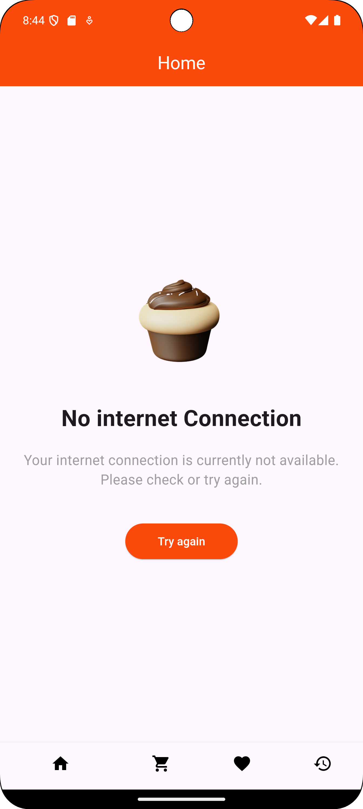
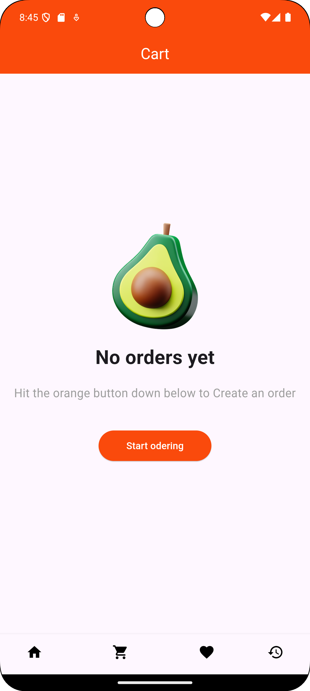
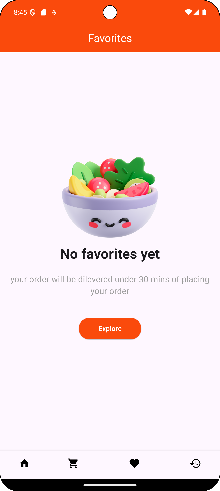
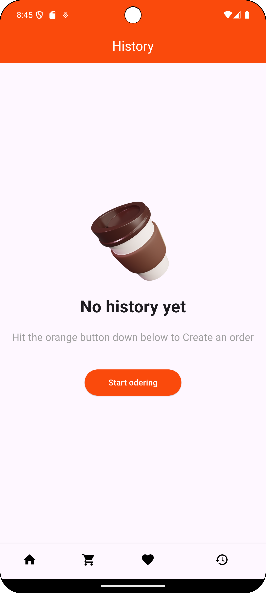

# Flutter Shopping App

## Overview

This Flutter application is a multi-functional shopping app that includes a splash screen, home page, cart, favorites, and order history pages. It provides a clean and simple user interface, making it easy to navigate through different sections of the app.

## Features

- **Splash Screen**: Displays an introductory splash screen with a 3-second delay before navigating to the home page.
- **Home Page**: Contains a bottom navigation bar to switch between the home, cart, favorites, and history pages. The title of the app bar changes dynamically based on the selected tab.
- **Cart Page**: Displays a message when no orders have been added yet, with an option to start ordering.
- **Favorites Page**: Displays a message when no items have been added to favorites yet.
- **History Page**: Shows a message when no order history is available.

## Pages

- **SplashScreen**
- **HomePage**
- **CartPage**
- **FavoritesPage**
- **HistoryPage**

## Getting Started

### Prerequisites

- [Flutter](https://flutter.dev/docs/get-started/install) should be installed on your machine.
- An IDE such as [VS Code](https://code.visualstudio.com/) or [Android Studio](https://developer.android.com/studio).

### Installation

To run this project, ensure you have the Flutter SDK installed and configured. Follow the steps below:

1. Clone the repository:
   ```bash
   git clone <repository-url>
   ```
2. Navigate to the project directory:
   ```bash
   cd flutter_shopping_app
   ```
3. Install dependencies:
   ```bash
   flutter pub get
   ```
4. Run the app:
   ```bash
   flutter run
   ```
### Running the App

1. Connect your device or start an emulator.
2. Run the app:
   ```bash
   flutter run
   ```

## Screenshots











